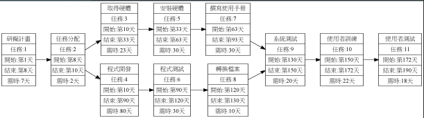
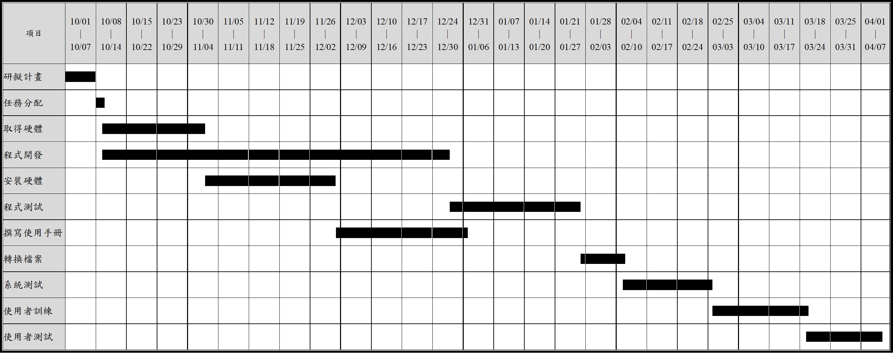

### C108118204 資管三乙 沈翔竣
***
| 任務 | 說明 | 需時（天） | 前置任務 | 
|:-:| :----: | :-:| :----:|
| 1 | 研擬計畫 | 7 | - | 
| 2 | 任務分配 | 2 | 8 | 
| 3 | 取得硬體 | 23 | 10 | 
| 4 | 程式開發 | 80 | 10 | 
| 5 | 安裝硬體 | 30 | 33 | 
| 6 | 程式測試 | 30 | 90 | 
| 7 | 撰寫使用手冊 | 30 | 63 | 
| 8 | 轉換檔案 | 10 | 120 | 
| 9 | 系統測試 | 20 | 130 | 
| 10 | 使用者訓練 | 22 | 150 | 
| 11 | 使用者測試 | 18 | 172 | 
***

## PERT/CPM

## 關鍵路徑
# 1->2->4->6->8->9->10->11

## Gantt Chart

